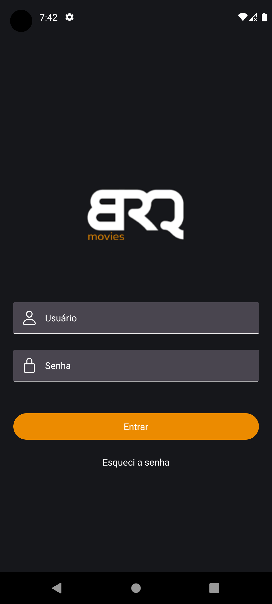
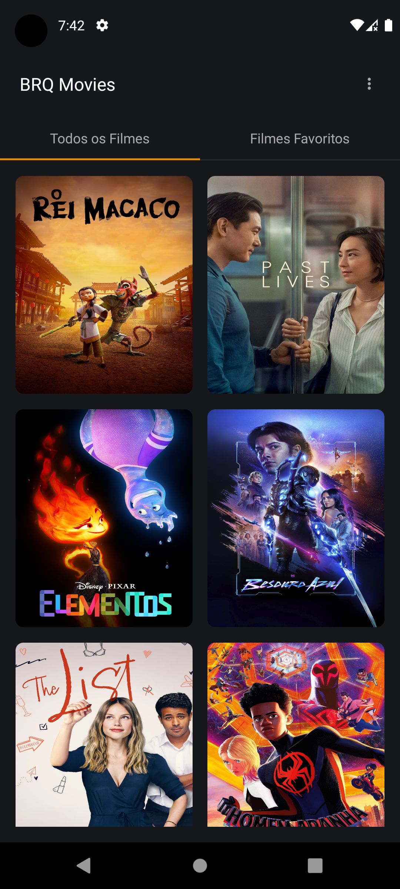
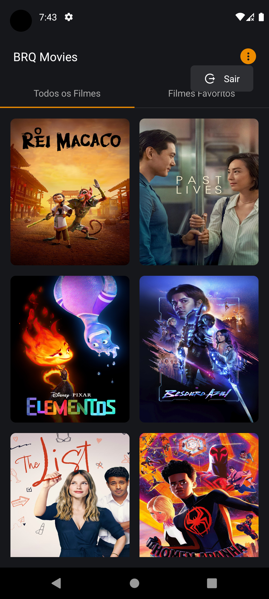
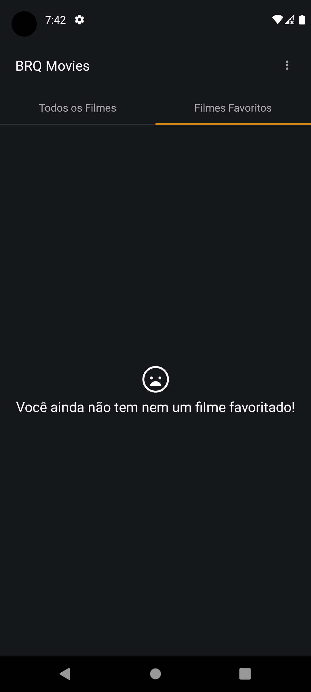

# BRQ Movies

|  |  | |  |
|  |  | |  |

# Principais bibliotecas

## NativeWind

Biblioteca do tailwindcss para React Native, escolhi ela pela facilidade e rapidez de montagem de telas

## React Navigation

Utilizada para fazer navegações no app, como também para criação de navigation tabs

## Async Storage

Biblioteca de armazenamento local, utilizei pra guardar a sessão do usuário

## Net Info

Biblioteca que verifica a conexão de internet

## Vector Icons

Biblioteca que disponibiliza os ícones

## Jest Testing Library

Utilizada para testar componentes que precisam de renderização, como por exemplo os context

## Jest Mock Extended

Biblioteca que facilita fazer os mocks
